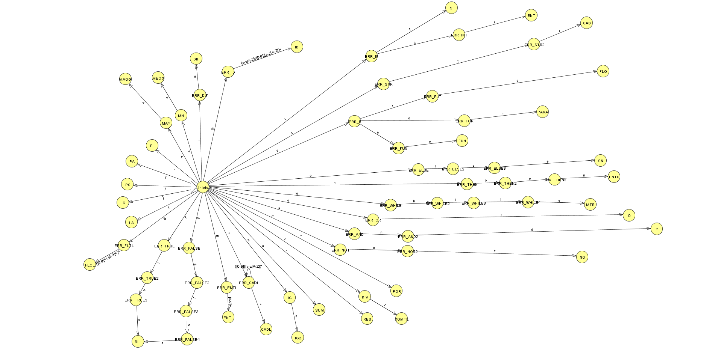

# prj-lenguajes
El presente proyecto se realizó sólo con fines educativos con el objetivo de entender un poco la estructura de un lenguajes de programación. Además, se implementó el algoritmo LLR para el análisis sintáctico del código; También se implementó un ejemplo de generación de código intermedio.

### Funcionalidades.

- Identificación de tokens mediante un autómata.
- Análisis sintáctico mediante LLR.
- Generación de un arbol de ambientes.
- Generación del árbol para el analisis sintáctico y que podría servir para el análisis semántico.
- Editor de código específico para el lenguaje creado.

Automata para el análisis léxico

### Previews

Creación de variables y tipos de datos.

Ejemplo de un condicional if

Ejemplo de un ciclo for

Creación de un ciclo while

Creación de una función.

Ejemplo completo.